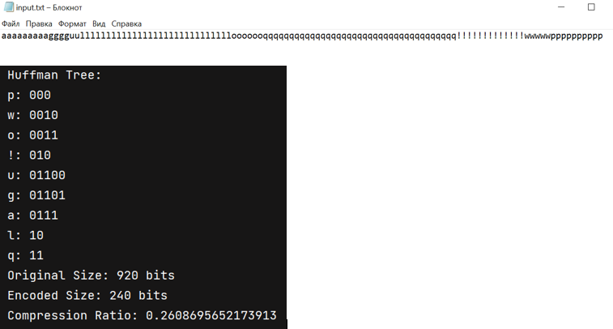

# Huffman Coding

Huffman Coding is a Java implementation of the Huffman coding algorithm. 
This program allows you to encode and decode text files using Huffman coding, providing information about compression ratios.

## Usage

1. **Input File**: Place the text you want to compress in the `input_output_files/input.txt` file.
2. **Build and Run**: Follow the instructions in `src/build.txt`,`src/user-guide.txt`to build and run the program.
3. **Output Files**:
   - Encoded binary data will be saved in `input_output_files/encoded.bin`.
   - Decoded text will be saved in `input_output_files/decoded.txt`.

## Results

After running the program, you'll get information about the compression process, including:
- Original Size: Size of the original text file in bits.
- Encoded Size: Size of the encoded binary file in bits.
- Decoded Size: Size of the decoded text file in bits.
- Compression Ratio: Ratio of compressed size to the original size.

## Implementation Details

- The Huffman coding algorithm builds a Huffman tree based on character frequencies in the input text.
- The tree is then used to generate Huffman codes for each character.
- The original text is encoded using these Huffman codes and saved as a binary file.
- Decoding involves reading the binary file, reconstructing the Huffman tree, and decoding the encoded text.

## Files

- `HuffmanCoding.java`: Main class containing the Huffman coding implementation.
- `HuffmanNode.java`: Class defining the structure of a Huffman tree node.

## Example

